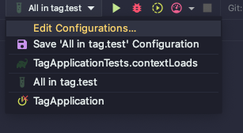

# Junit5 Tag → Filtering

블로그
- https://binux.tistory.com/131

---

# Tag

Junit5에서는 `Tag` 어노테이션을 제공하고 있습니다.

## Overview

Tag는 어떤 기능을 하는 어노테이션일까요? [공식문서](https://junit.org/junit5/docs/current/user-guide/#running-tests-tags) 에 의하면 다음과 같습니다.

> Tags are a JUnit Platform concept for marking and filtering tests. The programming model for adding tags to containers and tests is defined by the testing framework. For example, in JUnit Jupiter based tests, the `@Tag` annotation (see [Tagging and Filtering](https://junit.org/junit5/docs/current/user-guide/#writing-tests-tagging-and-filtering)) should be used.
> 

즉,  `Tag` 어노테이션의 목적은 테스트에 어떤 테스트인지 표기하는 동시에 필터링하는 것입니다.

`Tag` 어노테이션의 사용 사례를 봅시다. 엄청 간단합니다.

```java

@Tag("unit")
class ApplicationUnitTests {

    @Test
    @Tag("foo")
    void fooTest() {
        var foo = true;
        assertThat(foo).isTrue();
    }

}
```

- 예에서 볼 수 있는 것처럼 클래스 단위로 붙일 수도 있고, 메서드 단위로 붙일 수 있습니다.
    - [어노테이션 코드 참고](https://github.com/junit-team/junit5/blob/main/junit-jupiter-api/src/main/java/org/junit/jupiter/api/Tag.java#L57)

예시를 더 살펴볼까요?

```groovy
@Tag("integration")
class ApplicationIntegrationTests {

    @Test
    @Tag("bar")
    @Tag("feature-001")  // Multiple tag
    void barTest() {
        var bar = false;
        assertThat(bar).isFalse();
    }

		@Test
    @Tags({
            @Tag("baz"),
            @Tag("feature-001")
    })
    void bazTest() {
        var baz = List.of("baz");
        assertThat(baz).contains("baz");
    }

}
```

- 2개 이상의 `Tag`를 사용할 수도 있습니다.

---

## Filtering

**그럼, ‘테스트의 필터링’은 무엇일까요?** 

가끔 테스트를 하다보면 특정 테스트만 실행하고 싶은 경우가 있습니다. 특정 feature에 대해서만 테스트를 하고 싶다거나, 시간이 오래걸리는 통합 테스트는 제외시키고 테스트하고 싶다거나 말이죠. 이런 경우에 필터링해서 실행시킬 수 있습니다. 이를 위해서는 gradle 수정이 필요합니다.

```groovy
// build.gradle file

// test task
tasks.named('test') {
    // unit tag가 들어가고, bar tag가 들어가지 않은 테스트를 실행한다.
    useJUnitPlatform {
        includeTags 'unit'
        excludeTags 'bar'
    }
}
```

- test task에서 `useJUnitPlatform` 내 `includeTags`, `excludeTags` 값을 통해 설정할 수 있습니다.
- 예시같이 설정한 경우, `unit Tag` 가 들어가면서 `bar Tag` 가 들어가지 않은 경우의 테스트를 수행하게 됩니다.

하지만 위와 같이 한다면, `gradle test` 명령에만 의존해서 테스트를 구성해야합니다.

- 예를 들어, 통합 테스트는 `gradle test` 에서 제외하고, 다른 task를 구성하여 통합 테스트만 수행할 수 있게 구성하고 싶은 경우도 있을 겁니다.
- 이런 경우에도 위와 유사하게 task를 만들어 사용하면 됩니다.

```groovy
// build.gradle

// `gradle test`: integration tag가 붙은 테스트는 제외
tasks.named('test') {
    useJUnitPlatform {
        excludeTags 'integration'
    }
}

// `gradle integrationTest`: integration tag가 붙은 테스트만 수행
task integrationTest(type: Test) {
    useJUnitPlatform {
        includeTags 'integration'
    }
}
```

위 주석에서 작성한 것처럼

- integration tag가 붙지 않은 테스트 실행: `gradle test`
- integration tag가 붙은 테스트 실행: `gradle integrationTest`

명령을 통해 실행할 수 있습니다.

---

## Tag with Intellij

Intellij에서도 test 시, Tag를 사용할 수 있습니다.

상단의  `Edit Configurations` 에 들어갑니다.



Junit test에서 스크린샷에 보이시는 것처럼 `Tags` 를 선택합니다.


`integration tag` 가 붙은 테스트만 수행하고 싶은 경우에 다음과 같이 하면 됩니다.


- 즉, 원하는 Tag를 적어주면 해당 Tag가 붙은 테스트만 수행합니다.
- 만약 2개 이상의 태그를 원하는 경우, `&`, `|` 조건으로 연결해주면 됩니다.
    - 예를 들어 unit tag와 foo tag가 붙은 테스트만 수행하고 싶다면, `unit&foo` 를 적어주면 됩니다.
    

만약 특정 Tag가 붙지 않은 테스트만 수행하고 싶다면 `!` 를 사용하면 됩니다.

